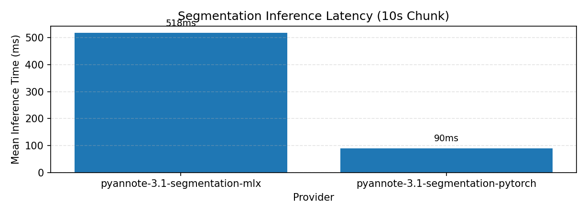

# MirrorNote Diarization MLX

Local speaker diarization experiments for MirrorNote.

This repository starts with an oracle-first path: run `pyannote/speaker-diarization-3.1` as the reference implementation, normalize its output into MirrorNote's artifact contract, and only then port the proven path to MLX.

## Status

Planning scaffold plus offline segmentation parity contracts, the `segmentation validate-report` CLI, and a gated pyannote segmentation probe CLI exist. The pyannote runtime path remains opt-in because it requires extra dependencies and Hugging Face credentials.

## First Principle

MirrorNote does not need a generic diarization playground. It needs a local, measurable, app-compatible way to turn `system-track.wav` into stable speaker labels.

## Target Output

The default CLI output is MirrorNote-native:

```text
out/
  speaker-segments.jsonl
  speaker-map.json
  metrics.json
```

RTTM export can exist later as an optional debug/export format. It is not the product contract.

## Source Model

Initial reference model:

- `pyannote/speaker-diarization-3.1`
- License: MIT, per the Hugging Face model card
- Runtime: `pyannote.audio` 3.1+ / PyTorch
- Input: mono 16 kHz audio, with pyannote able to downmix/resample when loading

Links:

- https://huggingface.co/pyannote/speaker-diarization-3.1
- https://github.com/pyannote/pyannote-audio/blob/main/LICENSE
- https://opensource.apple.com/projects/mlx/

## Documents

- [Identity](docs/IDENTITY.md)
- [Implementation Plan](docs/IMPLEMENTATION_PLAN.md)

## M4A Segmentation Parity

The first MLX milestone is segmentation parity, not full diarization. The initial goal is to match the segmentation component against the reference path before expanding into the rest of the diarization pipeline.

Run the baseline test suite with:

```bash
uv run pytest
```

Validate a segmentation parity report with:

```bash
uv run mirrornote-diarize segmentation validate-report reports/segmentation-parity/example.json
```

Compare saved segmentation reference and candidate `.npz` artifacts with:

```bash
uv run mirrornote-diarize segmentation compare-npz --reference artifacts/reference.npz --candidate artifacts/candidate.npz --source fixtures/single-speaker/system-track.wav --out reports/segmentation-parity/compare.json
```

Run the gated pyannote segmentation probe with:

```bash
MIRRORNOTE_RUN_PYANNOTE_PROBE=1 HUGGINGFACE_ACCESS_TOKEN="$HUGGINGFACE_ACCESS_TOKEN" uv run mirrornote-diarize segmentation probe --audio fixtures/single-speaker/system-track.wav --out artifacts/probe
```

Inspect a saved segmentation probe with:

```bash
uv run mirrornote-diarize segmentation inspect-probe artifacts/probe --json-out reports/segmentation-parity/probe-summary.json
```

The probe command is registered, but it is intentionally gated by `MIRRORNOTE_RUN_PYANNOTE_PROBE=1` and `HUGGINGFACE_ACCESS_TOKEN`. Generated probe artifacts should not be committed unless they are small, deterministic metadata files.

## M4C MLX Candidate Path

Generate a local waveform input artifact from the dummy probe audio when needed:

```bash
uv run --extra audio python - <<'PY'
from pathlib import Path
import numpy as np
import soundfile as sf
from mirrornote_diarization.chunking import extract_fixed_chunk
waveform, sample_rate = sf.read('artifacts/audio/librispeech-dummy-probe/audio.wav', dtype='float32')
chunk = extract_fixed_chunk(waveform, sample_rate=sample_rate, start_seconds=0.0, duration_seconds=10.0)
path = Path('artifacts/probe/librispeech-dummy-probe/waveform-input.npz')
path.parent.mkdir(parents=True, exist_ok=True)
np.savez(path, waveform=chunk.as_model_input())
print(path)
PY
```

Run the current MLX segmentation candidate:

```bash
uv run --extra mlx mirrornote-diarize segmentation mlx-candidate \
  --weights artifacts/probe/librispeech-dummy-probe/reference-weights.npz \
  --waveform-npz artifacts/probe/librispeech-dummy-probe/waveform-input.npz \
  --out artifacts/probe/librispeech-dummy-probe/mlx-candidate-output.npz
```

Compare the candidate against the reference output:

```bash
uv run --extra dev mirrornote-diarize segmentation compare-npz \
  --reference artifacts/probe/librispeech-dummy-probe/reference-output.npz \
  --candidate artifacts/probe/librispeech-dummy-probe/mlx-candidate-output.npz \
  --source artifacts/audio/librispeech-dummy-probe/audio.wav \
  --out reports/segmentation-parity/librispeech-dummy-mlx-compare.json
```

The current candidate is shape-correct only. `compare-npz` is expected to write a report and return nonzero until numerical parity work lands.

## Runtime Benchmark (10-second chunk)

Run the runtime comparison between the MLX candidate and the reference pyannote segmentation model:

```bash
uv run python scripts/benchmark_segmentation_runtime.py --runs 12 --warmup 3
```

For stage-level profiling (sincnet / lstm / linear):

```bash
uv run python scripts/benchmark_segmentation_runtime.py --runs 12 --warmup 3 --profile-stages
```

Current environment and settings:

- Input: `artifacts/probe/librispeech-dummy-probe/waveform-input.npz` (10.0 s, 16,000 Hz mono)
- Warm-up: 3 runs
- Measurement runs: 12
- Device/platform: `macOS-26.3-arm64-arm-64bit`

Result files:

- `reports/segmentation-benchmark/runtime-benchmark.json`
- `reports/segmentation-benchmark/runtime-benchmark.png`

Summary (mean across measured runs):

| Provider | Mean (ms) | Median (ms) | p95 (ms) | Real-time factor |
|---|---:|---:|---:|---:|
| `pyannote-3.1-segmentation-pytorch` | `55.96` | `51.65` | `70.63` | `178.69x` |
| `pyannote-3.1-segmentation-mlx` | `189.96` | `182.16` | `235.51` | `52.64x` |

Current interpretation for this run:
- `mlx_faster_than_pyannote_mean_time_x = 0.294` (less than 1.0 means MLX is slower).
- `speedupTargetMet` is `false` for 3x target.


